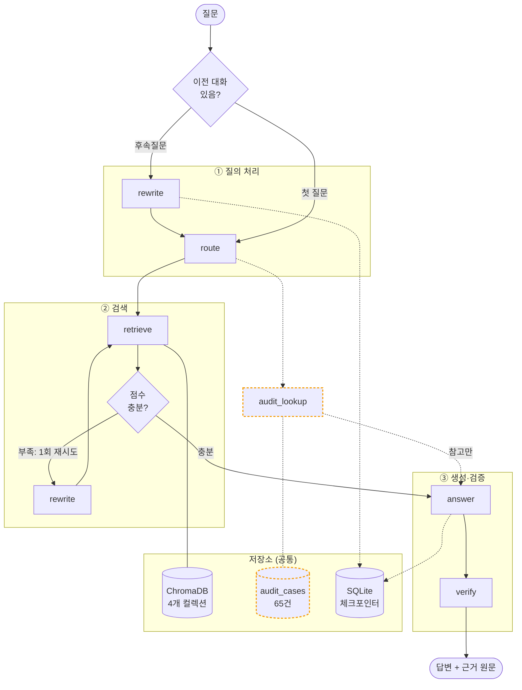

# 📘 회계기준 Manager

한국회계기준원(KASB)의 **K-IFRS 기준서 · 일반기업회계기준 · 질의회신**을 근거로 회계 질문에 답하는 RAG를 이용한 어시스턴트입니다. 일반적인 챗봇과 달리 **답변과 함께 그 근거가 된 기준서 원문을 그대로 보여주고**, 근거로 뒷받침되지 않는 질문에는 답을 지어내지 않고 "근거를 찾지 못했습니다"라고 물러섭니다. 회계 실무처럼 **출처 확인이 곧 신뢰인 도메인**에서, "그럴듯한 답"보다 "검증 가능한 답"을 우선하도록 설계했습니다.

## ▶︎ 지금 바로 사용해보기

[](https://huggingface.co/spaces/sonsdf/accounting-standards-assistant)

**🤗 Live Demo → https://huggingface.co/spaces/sonsdf/accounting-standards-assistant**
무료버전이기 때문에 로딩(starting)을 거쳐야 합니다.(로딩은 1~2분 소요될 수 있습니다.)


앱 사이드바에 본인 **OpenAI API 키**를 입력하면 바로 질문할 수 있습니다 (키는 세션 메모리에만 저장되고 파일·로그에 남지 않습니다).

> ⏳ **응답이 전반적으로 느릴 수 있습니다.** 무료 호스팅(Hugging Face Spaces)은 GPU가 없어 매 질문마다 임베딩·리랭킹 연산을 CPU로 처리합니다 — 로컬 실행(GPU/MPS)보다 느리고, Space에 할당된 서버 사양에 따라서도 체감 속도가 달라질 수 있습니다. 여기에 더해 앱이 한동안 쉬면 절전 상태로 들어가, 처음 접속하거나 첫 질문을 던질 때는 모델(BGE-M3 · bge-reranker-v2-m3, 합계 약 2.5GB)과 벡터DB(약 250MB)를 내려받는 1~2분 지연까지 추가로 붙습니다. 빠른 응답이 필요하면 저장소를 클론해 로컬(특히 Apple Silicon 등 GPU/MPS 가속 가능한 환경)에서 실행하는 것을 권장합니다.


---

## 1. 해결하는 문제

회계 기준은 K-IFRS와 일반기업회계기준 두 체계로 나뉘고 같은 주제라도 서로 다른 기준서 문단에서 다룹니다. 실무자는 "이 거래를 어느 기준의 어느 문단으로 처리하나"를 찾는 데 시간을 씁니다. 일반 LLM에 물으면 문단 번호를 그럴듯하게 지어내거나(환각) 두 체계를 뒤섞기 쉽습니다.

이 프로젝트는 KASB 코퍼스를 검색해 **실제 기준서 문단·질의회신을 근거로 답하고, 그 원문을 함께 제시**합니다. 답변은 생성하되 **근거는 DB 원문 그대로** 보여주어, 사용자가 답을 곧바로 검증할 수 있게 하는 것이 핵심입니다.

---

## 2. 주요 특징

- **UI** — ① 답변(인용 배지 포함) ② 근거 원문 카드(클릭 시 해당 근거로 이동) ③ 해설. 답변보다 **근거를 먼저** 렌더해 대기 체감을 줄이고 검증을 유도합니다.
- **하이브리드 검색** — BM25(어휘) + dense(의미) 병합 후 리랭커로 재정렬.
- **멀티 LLM** — GPT 기본 / 로컬 EXAONE 옵션(폐쇄망·오프라인용).
- **환각 방지** — 검색 근거로만 답하고, 근거가 없으면 refusal. 근거 원문은 LLM이 다시 쓰지 않고 DB 원문을 그대로 표시.
- **감리지적사례 참고** — 관련된 금융감독원 감리지적사례가 있으면 답변과 **완전히 분리된** 참고 정보로 함께 보여줍니다(답변의 근거로는 절대 사용하지 않음).
- **RAGAS 평가** — 검색(Recall)은 골든셋으로 기계 채점, 생성(Faithfulness/Relevancy)은 LLM 판사로 평가.

---

## 3. 시스템 아키텍처

LangGraph 5개 노드가 질문을 처리하고 별도 사이드카 1개가 참고 정보를 곁들입니다. 검색은 4개 컬렉션(기준서 2 + 질의회신 2, 전부 KASB 자료)으로 나눠 라우터가 필요한 곳만 고르게 했고 SQLite 체크포인터로 대화 맥락을 이어갑니다. 점선으로 표시한 경로는 답변 근거로 쓰이지 않는 **참고 전용** 흐름입니다.



> ※ `rewrite`는 실제로는 하나의 노드입니다 — 그림에서는 진입 시점(후속질문 맥락 반영 vs 검색 실패 재시도)에 따라 편의상 두 번 나눠 그렸습니다. `rewrite`·`route`·`answer`는 기본 GPT(`gpt-4o-mini`/`gpt-5.5`)가 처리하고, 로컬 모드에서는 EXAONE 3.5가 대신합니다. 점선 테두리(`audit_lookup`/`audit_cases`)는 답변 근거로 쓰이지 않는 참고 전용 경로입니다.

| 노드 | 역할 | 핵심 기술 |
|---|---|---|
| `rewrite` | 질문을 검색 친화적으로 재작성(후속질문 맥락 반영 또는 검색 실패 시 1회 재시도) | GPT `gpt-4o-mini` / 로컬 EXAONE 3.5 |
| `route` | 질문 성격(K-IFRS/일반기업)에 맞는 컬렉션 선택, 모호하면 양쪽 다 포함 | GPT `gpt-4o-mini` / 로컬 EXAONE 3.5 |
| `retrieve` | 하이브리드 검색 + 리랭킹, 라우팅된 기준서 컬렉션마다 최소 1건 보장 | BM25 + BGE-M3 dense → RRF → `bge-reranker-v2-m3` |
| `answer` | 검색 근거만으로 답변 생성, 근거 식별자를 문장에 인용 | GPT `gpt-5.5` / 로컬 EXAONE 3.5 |
| `verify` | 답변이 인용한 근거를 DB에서 원문 그대로 재조회 | ChromaDB 직접 조회(LLM 재생성 없음) |
| `audit_lookup` (사이드카) | 금융감독원 감리지적사례 참고 조회 — 답변 근거로 절대 미사용 | ChromaDB `audit_cases` 컬렉션(65건) |

**노드별 상세**

- **rewrite**: 이전 대화를 반영해 질문을 검색에 유리하게 다시 씁니다.
(**조건부로 동작합니다** — 히스토리(후속질문)가 있으면 route 전에 무조건 실행하고(맥락 해소는 검색 점수와 무관하게 항상 필요), 히스토리가 없는 첫 질문은 route→retrieve를 먼저 시도한 뒤 **1차 검색 결과의 top 리랭커 점수가 0.6 미만일 때만** rewrite→retrieve로 재시도합니다(1회 한정, 무한루프 방지 — 재시도해도 다시 낮으면 그대로 answer로 넘어감). GPT(`gpt-4o-mini`) 기본, 로컬 모드에서는 EXAONE가 대신 처리합니다.)
- **route**: K-IFRS/일반기업 신호를 보고 검색할 컬렉션을 고릅니다. 신호가 모호하면 한쪽으로 좁히지 않고 양쪽 기준서·질의회신을 모두 검색해, 정답 컬렉션을 통째로 놓치는 일을 막습니다. rewrite와 마찬가지로 로컬 모드에서는 EXAONE가 처리합니다.
- **retrieve**: 하이브리드 검색 + 리랭킹. 라우팅된 각 기준서 컬렉션에서 최소 1건씩 보장합니다. **이유**: 리랭커가 질의회신(Q&A)을 기준서 문단보다 구조적으로 훨씬 높게 평가해서(실측 0.9 vs 0.1) 점수 순으로만 top-k를 자르면 정답인 기준서 문단이 밀려 통째로 빠질 수 있고, K-IFRS·일반기업 기준서가 둘 다 라우팅된 모호한 질문에서는 한쪽이 슬롯을 독식해 다른 쪽 정답이 **라우팅은 맞았는데도** 사라질 수 있습니다(실제로 "개발비 자산인식요건" 질문에서 정답 문단이 4컬렉션 합산 리랭킹 17위로 밀려 GPT가 비결정적으로 refusal하던 버그가 있었습니다). 그래서 라우팅된 각 `*_standards` 컬렉션마다 최소 1개는 top-k에 무조건 포함시킵니다 
- **audit_lookup**: route 이후 `retrieve`와 별개로 **금융감독원 감리지적사례**(별도 `audit_cases` 컬렉션, 65건)를 조회합니다. `retrieve`가 쓰는 4개 컬렉션과 완전히 분리돼 있고, `answer` 노드는 이 결과를 답변 근거로 **절대 사용하지 않습니다** — 관련 사례가 있으면 답변과 나란히 참고 정보로만 보여줍니다.
- **answer**: 검색 근거만 사용해 답하고, 인용은 `[제1116호 문단 7]`처럼 근거 식별자를 문장에 넣습니다.
- **verify**: 답변이 인용한 근거를 DB에서 **원문 그대로** 조회해 반환합니다(LLM 재생성 금지 → 원문 왜곡 방지).

### 실제 동작

아래는 *"회사가 상표권 출원·등록 관련 법률수수료를 지출한 경우 무형자산으로 인식할 수 있는가?"* 질문의 실제 결과입니다.

**① 근거 원문 카드** — 검색된 기준서·질의회신을 **원문 그대로**(LLM 재생성 없음) 보여주고 ★는 답변이 실제 인용한 근거입니다.


**② 답변 + 인용 + 품질 평가** — 문장마다 근거 식별자를 인용하고 옵션을 켜면 LLM 판사가 근거 충실도·질문 관련성을 채점합니다(판사와 답변이 같은 벤더면 자기편향 경고).


### 참고: 감리지적사례 사이드카 (답변과 분리된 정보)

기준서 질문에는 종종 "실제로 이렇게 처리했다가 지적받은 사례가 있는가"가 함께 궁금해집니다. 그래서 금융감독원 감리지적사례를 답변과 나란히 보여줍니다.(하지만 **완전히 분리된 형태**로 보여줍니다.)

- **격리**: 감리사례는 기준서·질의회신과 별도의 ChromaDB 컬렉션(`audit_cases`)에 있고 질문 라우팅 후보에도 절대 섞이지 않습니다. `answer` 노드는 이 컬렉션을 참조하지 않으므로 감리사례가 답변 문장이나 인용에 영향을 주는 일은 구조적으로 불가능합니다.
- **자동 판정**: 매 질문마다 조용히 관련 사례를 검색하여 리랭커 점수가 임계값(0.6)을 넘을 때만 표시합니다. 관련 사례가 없으면 아무것도 나타나지 않습니다(억지로 끼워 맞추지 않음).


**① 답변 하단의 참고 배너** — 관련 감리사례가 있을 때만 나타나는 강조 버튼입니다.


**② 클릭 시 우측 패널** — 사실관계·지적사항·판단근거와 금융감독원 원문 링크를 원문 그대로 보여줍니다.


---

## 4. 기술 스택과 선택 이유

### 데이터 수집·파싱
기준서와 질의회신은 KASB 게시판에서 HWP·PDF로 제공됩니다. HWP는 표 안에 핵심 내용이 들어가는 경우가 많은데, `hwp5txt`로 텍스트만 뽑으면 **표 구조가 통째로 유실**됐습니다. 그래서 `hwp5html`로 변환해 HTML 표를 파싱하는 방식을 택했습니다. 구형 문서는 스캔 PDF가 섞여 있어 `pdfplumber`를 썼는데, 2단 레이아웃에서 텍스트 순서가 뒤엉키는 문제를 좌표 기반으로 정렬해 **읽기 순서를 보존**했습니다.

### 청킹
레코드 1개를 청크 1개로 두고 **추가 분할을 하지 않았습니다.** 코퍼스가 이미 문단·용어정의·질의회신 Q&A 단위로 정제돼 있어서 여기에 고정 크기 분할을 덧대면 짧은 조각이 양산됩니다. 짧은 조각은 임베딩이 밋밋해져 검색에서 오히려 불리하고 문단 경계를 잘라 근거 인용의 단위(문단 번호)와도 어긋납니다. "이미 의미 단위로 나뉜 데이터는 그 단위를 존중한다"는 판단입니다.

### 임베딩
`BAAI/bge-m3`를 골랐습니다. 한국어를 포함한 다국어에 강하고 로컬에서 구동할 수 있어(폐쇄망 지원 목표) API 의존 없이 dense 검색을 돌릴 수 있기 때문입니다. 긴 문단을 위해 fp16으로 올려 메모리·속도를 확보했습니다.

### 검색
3단계 파이프라인입니다.

1. **후보 수집(넓게)** — BM25(어휘 통계, `rank_bm25`)와 dense(BGE-M3 임베딩, 코사인 유사도)를 **각각 독립적으로** 돌려 후보를 모읍니다. 두 방식은 놓치는 지점이 서로 달라서(BM25는 의미는 몰라도 정확한 키워드·문단번호에 강하고, dense는 표현이 달라도 의미가 통하면 잡음) 한쪽만 쓰면 다른 쪽이 잡는 후보를 통째로 놓칩니다.
2. **병합(등수 기반)** — **RRF(Reciprocal Rank Fusion, k=60)**로 두 순위 리스트를 합칩니다. BM25 점수(예: 18.3)와 dense 코사인 유사도(0~1)는 스케일이 완전히 달라 직접 비교·가중합이 불가능합니다. RRF는 점수 대신 **등수만** 써서(`Σ 1/(k+등수)`) 이 문제를 우회합니다.
3. **재정렬(정밀)** — 병합된 상위 30개 후보만 `BAAI/bge-reranker-v2-m3`(cross-encoder)에 (질문, 문단) 쌍으로 넣어 다시 채점합니다. RRF만 쓰면 상위 후보들의 점수가 0.03 언저리로 평탄하게 뭉쳐 순서를 가리기 어려운데, 크로스 인코더 리랭커가 의미적 관련도를 직접 판단해 **점수를 벌려 정답을 상단으로 끌어올립니다.** 리랭커는 fp16 + max_length 512로 로드해, 대부분 짧은 문단에서 속도 손해 없이 처리합니다. 후보가 BM25에서 왔든 dense에서 왔든 이 단계에서는 출신을 안 따지고 동일하게 재평가합니다.


**`bge-reranker-v2-m3`(568M)를 고른 이유 — 개발·서빙 환경(맥미니, Apple M4, 통합메모리 16GB) 제약:** BAAI 리랭커 라인업 중 벤치마크(BEIR·MIRACL)에서 더 높은 점수를 내는 모델(`bge-reranker-v2.5-gemma2-lightweight`, Gemma2-9B 기반)도 있지만 채택하지 않았습니다. 9B 파라미터는 fp16 가중치만으로도 약 18GB(9B×2byte)라 **이 맥미니의 통합메모리 16GB를 그 자체로 초과**합니다(임베더·ChromaDB·OS까지 얹으면 더 빠듯해짐). 반면 `bge-reranker-v2-m3`는 568M이라 fp16 가중치가 약 1.1GB에 불과하고, 임베더(BGE-M3)와 함께 올려도 실측 피크 메모리가 RSS 기준 ~3.1GB(최악 시나리오 ~6GB)로 16GB 안에 여유 있게 들어갑니다. "최고 성능"보다 **"이 하드웨어에서 로컬 구동이 가능한가"**를 우선한 선택입니다.

### 벡터DB
`ChromaDB`를 쓰고 **4개 컬렉션으로 분리**했습니다. 이 분리는 곧 라우팅 단위입니다. 초기에 한 컬렉션에 다 넣었더니 질의회신이 상위 결과를 독식해(질문과 문체가 비슷해 유사도가 높음) 정작 정답인 기준서 문단을 밀어냈습니다. 컬렉션을 나누고 라우터가 대상을 고르게 하니 이 편향이 크게 줄었습니다.

### LLM
기본은 GPT, 옵션으로 로컬 EXAONE입니다. 노드마다 필요한 능력이 달라 모델을 분담했습니다 — 가볍고 정형적인 `rewrite`·`route`는 `gpt-4o-mini`, 근거를 읽고 인용까지 지켜야 하는 `answer`는 `gpt-5.5`. GPT를 기본으로 둔 건 답변 품질과 **인용 형식 준수**가 안정적이기 때문입니다. EXAONE(`exaone3.5:7.8b`, Ollama) 옵션을 둔 건 한국어 회계 텍스트에 강하고 **로컬 구동으로 폐쇄망·오프라인을 지원**하기 위해서입니다. 

### 신뢰 검증
**답변은 생성하되, 근거 원문은 LLM이 다시 쓰지 않고 DB 원문을 그대로** 화면에 싣습니다. 요약·재서술 과정에서 원문이 미묘하게 바뀌면 "근거"의 의미가 없어지기 때문입니다. 답변(생성) / 근거(원본 보존)를 분리해 **사용자가 답을 원문과 대조해 검증**할 수 있게 했습니다.

---

## 5. 성능 평가 (RAGAS)

### 검색 성능 (골든셋 1,195건, 기계 채점 · LLM 비용 0)

질의회신이 인용한 기준서 문단을 정답으로 삼아 검색이 그 근거를 회수하는지 측정했습니다. recall을 **여러 관점으로 병기**해 정직하게 보여줍니다(엄격한 문단 exact부터, 질의 단위 성공률인 hit rate, 실질 성능에 가까운 호 recall까지). **아래 수치는 평가용으로 후하게 설정한 값이 아니라, 실제 채팅 앱(`rag/graph.py`의 `retrieve()`)이 쓰는 설정 그대로(BM25+dense 하이브리드→RRF→리랭킹, per_coll=12) 측정한 값입니다.**

| 지표 | top-5 | top-10 | 무엇을 재나 |
|---|---|---|---|
| **호 recall** | 0.728 | **0.791** | 올바른 기준서(제NNNN호/제N장)를 찾았는가 |
| **문단 hit rate** | 0.302 | **0.386** | 정답 문단을 **1개라도** 회수한 질의 비율(Hit@k) — "최소 1건 근거 확보" 성공률 |
| 문단 recall (exact) | 0.205 | 0.267 | 인용된 정확한 문단까지 회수 — **가장 엄격** |
| 문단 recall (인접완화) | 0.236 | 0.302 | 정답 문단 1.0 + 바로 옆(±1) 문단 0.5점 |


**대조군으로 직접 검증**: "질문이 조문 표현에 가까우면 exact가 오르는가?"를 실제로 확인하려고, kifrs **공식 용어정의 레코드 393개 전부**(부록A 용어표 + 일부 기준서의 본문 콜론 정의 — 표본을 일부러 뽑지 않고 존재하는 용어 전체)로 **정의조회형 문답셋**을 별도로 만들었습니다("{용어}의 정의는?" 등 고정 템플릿 3종을 기계적으로 순환 배정 — 사람이 케이스별로 쉬운 용어를 골라 다듬지 않음). 이것도 프로덕션과 동일 설정(per_coll=12, BM25 하이브리드)으로, 메인 지표와 같은 4개 관점을 전부 측정했습니다.

| 지표 | top-5 | top-10 |
|---|---|---|
| 호 recall | 0.926 | 0.934 |
| 용어 hit rate | 0.799 | 0.812 |
| exact | 0.799 | 0.812 |
| 인접완화 | 0.799 | 0.812 |

(exact·인접완화·hit rate가 거의 같은 값인 이유: 이 대조군은 문항당 정답 용어가 정확히 1개뿐이라 "1개라도 맞히면 hit=exact"가 되고, 용어 키는 문단번호 형식이 아니라 인접 판정 자체가 적용되지 않습니다. 호 recall이 더 높은 건, 정확한 용어까지는 못 맞혀도 소속 기준서 자체는 맞힌 경우가 있다는 뜻입니다.)

메인 골든셋의 26.7%보다는 여전히 뚜렷이 높습니다. **실패 74건(393건 중 18.8%)**은 수치를 부풀리지 않고 그대로 공개합니다 — 대부분 "공정가치"·"한국채택국제회계기준"처럼 **여러 기준서가 각자 따로 정의해둔 동명 용어**(어느 기준서의 정의를 원하는지 질문만으로는 모호)이거나, "실무적으로 적용할 수 없는"·"중요한"처럼 일상어와 겹치는 용어입니다. **이 393건은 메인 지표를 대체하지 않는 별도 보너스 지표입니다**(질문 스타일 자체가 다른 대조군). 이 결과는 "검색기가 원래 잘 작동하며, 메인 26.7%가 낮은 건 실무 시나리오 질문의 표면 격차 때문"이라는 위 설명을 여전히 뒷받침합니다. (스크립트: [`eval/build_definition_goldenset.py`](eval/build_definition_goldenset.py), [`eval/run_definition_eval.py`](eval/run_definition_eval.py) `--per-coll 12 --bm25`)

*질의회신은 그 자신도 코퍼스에 임베딩돼 있어 자기 자신을 검색해버리는 **self-leakage**가 생길 수 있습니다. 배치 평가에서는 검색 대상을 기준서 컬렉션으로 한정해 질의회신 자기 자신을 원천 제외하고, "정답 기준서 근거를 회수하는가"만 측정했습니다.

### 왜 질의회신을 함께 임베딩했는가

문단 recall이 낮은 이유가, 곧 이 시스템이 질의회신을 코퍼스에 포함한 이유이기도 합니다.

위 recall은 질의회신의 **질문(question)**으로 검색해 그 질의회신이 인용한 **기준서 문단(standard_refs)**을 찾아오는지로 측정했습니다. 그런데 질의회신 질문은 "복잡한 실무 상황 서술"이고 정답인 기준서 문단은 "추상적 규정"이라, 둘 사이의 표면적 표현 차이가 큽니다. 임베딩 검색은 의미가 가까운 것을 찾으므로, 개념어가 뚜렷한 기준서(호) 단위는 잘 찾지만(호 recall 79%), 실무 질문과 추상 규정 사이의 표면 격차 때문에 정확한 문단까지 직접 매칭하기는 어렵습니다(문단 recall 27%).

바로 이 격차를 메우려고 질의회신을 코퍼스에 함께 넣었습니다. 질의회신은 "실무 질문 + 답변 + 근거 문단"이 한 세트라, 사용자의 실무 질문과 표면이 유사합니다. 사용자가 복잡한 상황을 물으면 표현이 닮은 질의회신이 먼저 매칭되고, 그 질의회신이 이미 정답 기준서 문단을 인용하고 있어 기준서 근거까지 자연스럽게 연결됩니다. 질의회신이 **실무 질문과 기준서 사이의 다리** 역할을 하는 셈입니다.

그리고 앞서 밝혔듯 배치 평가는 self-leakage를 막으려 이 질의회신 경로를 제외하고 측정했습니다. 즉 다리를 걷어낸 **가장 불리한 조건**에서 나온 값이므로, 질의회신이 함께 작동하는 실제 사용에서의 체감 성능은 위 수치보다 높습니다.

### 생성 성능 (LLM 판사, GPT vs EXAONE)

같은 질문을 답변 모델만 바꿔 생성하고 동일 판사(Google Gemini, `gemini-2.5-flash-lite`)로 채점했습니다. GPT=OpenAI, EXAONE=로컬(비클라우드) 답변 모델이라 **둘 다 판사와 다른 벤더** — 자기편향 없이 양쪽 다 독립 평가입니다. **F=Faithfulness(근거 충실도), R=Answer Relevancy(질문 관련성).**

| 케이스 | GPT-5.5 *(독립 평가)* | EXAONE *(독립 평가)* |
|---|---|---|
| 단기리스 | F 1.0 / R 1.0 | refusal(채점 스킵) |
| 파생상품 | F 1.0 / R 1.0 | F 0.8 / R 1.0 |
| 틀린 전제 | F 0.8 / R 1.0 | refusal(채점 스킵) |
| 근거 없음(미국세법) | refusal | refusal |

> **판사를 OpenAI→Gemini로 교체한 이유:** 이전에는 GPT 답변을 OpenAI 판사가 채점해 **GPT 점수에 자기편향 여지**가 있었습니다(EXAONE만 독립 평가). Gemini로 바꾸면서 GPT·EXAONE 둘 다 판사와 다른 벤더가 되어 **양쪽 다 자기편향 없이 신뢰할 수 있는 점수**가 됐습니다.
>
> **관찰:** 파생상품 케이스는 EXAONE가 여전히 GPT보다 낮은 Faithfulness(0.8 vs 1.0)를 받아, 근거 이탈 경향이 판사를 바꿔도 재현됩니다. 다만 단기리스·틀린 전제 케이스에서는 EXAONE가 이번 실행에서 스스로 "근거를 찾지 못했습니다"로 refusal해 채점 자체가 스킵됐습니다 — 이전(2026-07-04, OpenAI 판사) 스냅샷에서는 같은 두 질문에 EXAONE가 정상 답변했었으므로, **LLM 특유의 비결정성**(같은 질문·같은 모델이라도 실행마다 refusal 여부가 달라짐)을 보여주는 사례입니다. 근거가 없는 질문(미국세법)은 두 모델 모두 매번 refusal해 환각 방지는 안정적으로 작동합니다.
>
> ※ 위 표는 2026-07-14 측정 스냅샷입니다(판사 Gemini 교체 후 재실행). 이전 OpenAI 판사 스냅샷(2026-07-04)과 마찬가지로, LLM 비결정성 때문에 재실행하면 점수·refusal 여부는 달라질 수 있습니다.

#### 실제 사례 — EXAONE의 낮은 Faithfulness 재현 검증 (2026-07-13)

*"전환사채와 신주인수권부사채의 회계처리 차이는 무엇인가?"* 질문을 EXAONE 경로로 실행했더니, 판사(OpenAI/gpt-4o-mini — Gemini 교체 이전 스냅샷)가 **Faithfulness 0.5**(Answer Relevancy는 1.0)를 매겼습니다. 이번 사례는 이전 OpenAI 판사 스냅샷(2026-07-04)에서 관찰된 두 유형(자체 지식 문단번호 인용·틀린 전제 미교정) 중 어느 쪽도 아니라, **근거를 인용하긴 했지만 그 인용에 근거 없는 결론을 덧붙이는** 세 번째 유형입니다.

**실제 검색된 근거(retrieve 결과, 상위 8건 · 점수순)**: `016003-1116`(0.992, qa_kgaap) · `제15장 문단 15.25`(0.934, kgaap_standards) · `016005-40600`(0.887, qa_kifrs) · `016005-38665`(0.873, qa_kifrs) · `016005-36939`(0.728, qa_kifrs) · `제15장 문단 15.25⑶`(0.726, kgaap_standards) · `016005-40573`(0.679, qa_kifrs) · `제1032호 문단 AG35`(0.153, kifrs_standards)

**EXAONE 답변 전문**(인용은 모두 위 검색 결과 안에 있는 것들로, 지어낸 조항 번호는 없었습니다 — `used_refs`: `제15장 문단 15.25⑶`, `016005-40600`, `제15장 문단 15.25`):
> 전환사채와 신주인수권부사채의 회계처리 차이는 주로 복합금융상품의 성격에 기인합니다.
>
> **전환사채**는 발행 시 금융부채와 자본요소(전환권)를 동시에 포함하는 복합금융상품으로 분류됩니다. 발행 초기에는 공정가치와 발행금액의 차이를 합리적인 배분기준(예: 유효이자율법, 정액법)에 따라 부채와 자본에 적절히 배분하여 회계처리합니다. 전환 시점에서는 전환된 주식의 가치를 자본으로 인식하며, 전환되지 않은 부분은 계속 부채로 관리됩니다 [제15장 문단 15.25⑶]. **전환사채의 공정가치와 발행금액의 차이가 존재할 경우, 이 차이는 시간이 지남에 따라 상각되거나 손익으로 인식될 수 있습니다 [016005-40600].**
>
> **신주인수권부사채** 역시 복합금융상품으로 분류되지만, 여기에는 신주인수권이라는 추가적인 자본 요소가 포함됩니다. 신주인수권의 매입이나 행사는 일반적으로 자본조정 항목으로 처리되며, 이는 기업의 자본구조에 영향을 미칩니다. 신주인수권이 종업원 등에게 무상으로 부여되는 경우에는 주식기준보상 회계처리 기준에 따라 처리됩니다 [제15장 문단 15.25]. 신주인수권의 공정가치와 발행금액의 차이는 주로 자본조정 항목으로 기록되며, 이 역시 시간이 지남에 따라 적절히 상각되거나 조정됩니다.
>
> **결론적으로, 두 금융상품 모두 복합적인 요소를 포함하고 있어 발행 및 전환 과정에서 공정가치와 발행금액의 차이 처리 방법이 유사한 측면이 있으나, 구체적인 회계처리는 각 요소의 성격과 기업의 회계정책에 따라 다소 차이가 있을 수 있습니다.** 특히 신주인수권의 경우 종업원 부여와 관련된 추가적인 회계처리 지침이 적용될 수 있습니다 [제15장 문단 15.25].

**판사가 "근거 없는 주장"으로 지목한 문장(굵게 표시한 두 곳)**은 정확히 이 둘입니다.
1. *"전환사채의 공정가치와 발행금액의 차이가 존재할 경우, 이 차이는 시간이 지남에 따라 상각되거나 손익으로 인식될 수 있습니다 [016005-40600]."*
2. *"결론적으로, 두 금융상품 모두 복합적인 요소를 포함하고 있어... 다소 차이가 있을 수 있습니다."*

이 지적이 맞는지 DB 원문과 직접 대조했습니다.

- **문장 1은 뜻밖에도 판사가 과하게 지적한 것으로 보입니다.** `016005-40600`의 실제 원문에는 "시장참여자가 전환사채의 가격을 결정하는 데에 고려하는 요소(시간 포함)의 변동을 반영하여 손익으로 인식함(제1109호 문단B5.1.2A)... 합리적 배분기준을 적용하여(예: 정액법, 유효이자율법) 상각해야 함"이라고 되어 있어, EXAONE의 문장과 내용이 크게 다르지 않습니다. 즉 **판사도 근거가 있는 문장을 "근거 없음"으로 오판할 수 있습니다** — 앞서 설명한 "판사가 관대해서 놓치는 경우"뿐 아니라 **"판사가 과해서 잘못 짚는 경우"도 관찰됩니다.**
- **문장 2는 판사의 지적이 타당해 보입니다.** 어떤 근거 식별자도 인용하지 않은 채 "유사한 측면이 있으나 차이가 있을 수 있다"는 두루뭉술한 결론을 덧붙였는데, 특정 근거 문단으로 추적되지 않는 전형적인 "그럴듯하지만 출처 없는 마무리 문장"입니다.

**정리**: 이 사례는 EXAONE가 실제로 낮은 Faithfulness를 받을 수 있다는 것(문장 2처럼 근거 없는 결론을 덧붙이는 경향)과, 동시에 **판사 채점도 절대적 기준이 아니라는 것**(문장 1처럼 실제로는 근거가 있는데 없다고 오판할 수도 있음)을 함께 보여줍니다. 그래서 이 프로젝트는 판사 점수 하나만 믿지 않고, `verify` 노드가 `used_refs`에 있는 근거를 DB에서 그대로 재조회해([rag/graph.py:342-354](rag/graph.py#L342-L354)) 사용자가 판사의 판정과 무관하게 원문과 직접 대조할 수 있게 합니다.

---

## 6. 설치 및 로컬 실행

**요구사항**: Python 3.9+, (로컬 EXAONE 사용 시) [Ollama](https://ollama.com)

```bash
# 1) 의존성 설치
python3 -m pip install -r requirements.txt

# 2) (선택) 로컬 EXAONE 사용 시
ollama pull exaone3.5:7.8b

# 3) 실행
python3 -m streamlit run rag/app.py
```

**API 키**는 `.env` 파일 또는 사이드바 입력창으로 넣습니다(입력값은 세션 메모리에만 저장).

```dotenv
# .env  (예시 — 실제 키는 커밋하지 마세요, .gitignore로 제외됨)
OPENAI_API_KEY=sk-...
# 선택: LangSmith 트레이싱
LANGCHAIN_API_KEY=lsv2_...
LANGCHAIN_PROJECT=kasb-rag
```

로컬 환경에서는 **GPT와 EXAONE를 모두** 쓸 수 있습니다. 사이드바 "모델 선택"에서 전환합니다.

---

## 7. 배포


**허깅페이스 Spaces**로 호스팅합니다. 무료 티어가 16GB RAM을 제공해 BGE-M3 임베더와 리랭커를 동시에 올릴 수 있기 때문입니다(Streamlit Community Cloud의 1GB로는 두 모델 동시 로드가 불가능했습니다). 벡터DB는 용량과 저작권 문제로 깃허브에 두지 않고, **허깅페이스 private 데이터셋**에 올려 앱 시작 시 토큰으로 내려받는 구조입니다. Spaces는 관리형이라 Streamlit SDK로 직접 생성되지 않아 **Docker SDK**로 배포했습니다(`Dockerfile`에서 Streamlit을 7860 포트로 구동).

**로컬 vs 배포 차이:**

| 환경 | 사용 가능 모델 |
|---|---|
| 로컬 | GPT + EXAONE(로컬) |
| 배포(Spaces) | GPT만 |

EXAONE가 배포판에서 빠지는 이유는 구동 방식 때문입니다. EXAONE는 **Ollama로 돌리는 로컬 모델**인데, Ollama는 사용자 머신이나 서버에 직접 설치해 실행하는 방식이라 허깅페이스 Spaces 같은 관리형 호스팅 환경에서는 띄울 수 없습니다. 그래서 배포판은 API 기반 GPT 경로만 제공하고, **EXAONE(로컬 폐쇄망용)는 저장소를 클론해 로컬에서 실행할 때** 사용하는 것으로 역할을 나눴습니다.

---

## 8. 데이터 출처

모든 원문 데이터는 **한국회계기준원(KASB)** 공개 게시판에서 수집했습니다 — [www.kasb.or.kr](https://www.kasb.or.kr)

- **K-IFRS 기준서** (기준서 문단·용어정의)
- **일반기업회계기준** (장·문단)
- **질의회신** (K-IFRS / 일반기업 각 게시판)

> **저작권 안내:** 기준서·질의회신 **원문의 저작권은 한국회계기준원(KASB)에 있습니다.** 이 저장소에는 코드와 **데이터 구조를 보여주는 소량 샘플**(`data/sample/`, 게시판·기준서별 2~3건)만 포함합니다. 전체 데이터는 저장소에 담지 않으며, 크롤러(`crawl/crawler.py`, `crawl/standards_crawler.py`)로 공식 출처에서 직접 수집해 재현할 수 있습니다. 상세 재현 절차는 `data/sample/`의 구조와 크롤러 스크립트를 참고하세요.

---

## 프로젝트 구조

```
rag/            # RAG 파이프라인 (LangGraph)
  ├─ app.py        # Streamlit UI (3층 신뢰 구조 + 감리사례 사이드카)
  ├─ graph.py      # 파이프라인 (rewrite→route→{retrieve,audit_lookup}→answer→verify)
  ├─ search.py     # 하이브리드 검색 (BM25+dense→RRF→리랭킹)
  ├─ llm.py        # 모델 추상화 (GPT / EXAONE)
  ├─ common.py     # 임베더·리랭커·컬렉션 정의
  ├─ sync_audit_cases.py       # 감리지적사례 동기화(audit-sentinel → audit_cases 컬렉션)
  ├─ install_audit_scheduler.sh # 감리사례 분기별 갱신 크론 등록(--print/--install)
  └─ eval/         # RAGAS 평가 (배치 + 실시간 판사) + 감리사례 검증(스모크테스트/표본검토)
crawl/                 # 크롤러
  ├─ crawler.py           # 질의회신 크롤러
  └─ standards_crawler.py # 기준서 크롤러
scripts/               # 일회성 수집·유지보수 드라이버 (run_qa_all·run_std·reparse_qa·join_eval)
refs.py                # ref_key 정규화 공용 코어 (crawl·parsers 양쪽이 참조)
parsers/               # HWP/PDF 파서
data/sample/           # 공개용 소량 샘플 (구조 예시)
eval/results/summary.md   # 검색 성능표
```

---

*made by gyuyeong*
