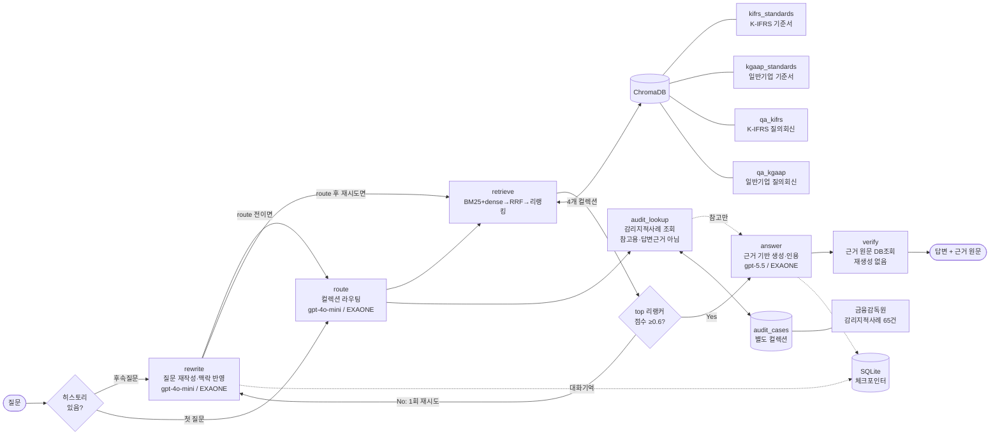

# 📘 회계기준 Manager

한국회계기준원(KASB)의 **K-IFRS 기준서 · 일반기업회계기준 · 질의회신**을 근거로 회계 질문에 답하는 RAG 어시스턴트입니다. 일반적인 챗봇과 달리 **답변과 함께 그 근거가 된 기준서 원문을 그대로 보여주고**, 근거로 뒷받침되지 않는 질문에는 답을 지어내지 않고 "근거를 찾지 못했습니다"라고 물러섭니다. 회계 실무처럼 **출처 확인이 곧 신뢰인 도메인**에서, "그럴듯한 답"보다 "검증 가능한 답"을 우선하도록 설계했습니다.

## ▶︎ 지금 바로 사용해보기

[](https://huggingface.co/spaces/sonsdf/accounting-standards-assistant)

**🤗 Live Demo → https://huggingface.co/spaces/sonsdf/accounting-standards-assistant**
무료버전이기 때문에 로딩(starting)을 거쳐야 합니다.


앱 사이드바에 본인 **OpenAI API 키**를 입력하면 바로 질문할 수 있습니다 (키는 세션 메모리에만 저장되고 파일·로그에 남지 않습니다).

> ⏳ **응답이 전반적으로 느릴 수 있습니다.** 무료 호스팅(Hugging Face Spaces)은 GPU가 없어 매 질문마다 임베딩·리랭킹 연산을 CPU로 처리합니다 — 로컬 실행(GPU/MPS)보다 느리고, Space에 할당된 서버 사양에 따라서도 체감 속도가 달라질 수 있습니다. 여기에 더해 앱이 한동안 쉬면 절전 상태로 들어가, 처음 접속하거나 첫 질문을 던질 때는 모델(BGE-M3 · bge-reranker-v2-m3, 합계 약 2.5GB)과 벡터DB(약 250MB)를 내려받는 1~2분 지연까지 추가로 붙습니다. 빠른 응답이 필요하면 저장소를 클론해 로컬(특히 Apple Silicon 등 GPU/MPS 가속 가능한 환경)에서 실행하는 것을 권장합니다.


---

## 1. 해결하는 문제

회계 기준은 K-IFRS와 일반기업회계기준 두 체계로 나뉘고, 같은 주제라도 서로 다른 기준서 문단에서 다룹니다. 실무자는 "이 거래를 어느 기준의 어느 문단으로 처리하나"를 찾는 데 시간을 씁니다. 일반 LLM에 물으면 문단 번호를 그럴듯하게 지어내거나(환각) 두 체계를 뒤섞기 쉽습니다.

이 프로젝트는 KASB 코퍼스를 검색해 **실제 기준서 문단·질의회신을 근거로 답하고, 그 원문을 함께 제시**합니다. 답변은 생성하되 **근거는 DB 원문 그대로** 보여주어, 사용자가 답을 곧바로 검증할 수 있게 하는 것이 핵심입니다.

---

## 2. 주요 특징

- **3층 신뢰 UI** — ① 답변(인용 배지 포함) ② 근거 원문 카드(클릭 시 해당 근거로 이동) ③ 해설. 답변보다 **근거를 먼저** 렌더해 대기 체감을 줄이고 검증을 유도합니다.
- **하이브리드 검색** — BM25(어휘) + dense(의미) 병합 후 리랭커로 재정렬.
- **멀티 LLM** — GPT 기본 / 로컬 EXAONE 옵션(폐쇄망·오프라인용).
- **환각 방지** — 검색 근거로만 답하고, 근거가 없으면 refusal. 근거 원문은 LLM이 다시 쓰지 않고 DB 원문을 그대로 표시.
- **감리지적사례 참고** — 관련된 금융감독원 감리지적사례가 있으면 답변과 **완전히 분리된** 참고 정보로 함께 보여줍니다(답변의 근거로는 절대 사용하지 않음).
- **RAGAS 평가** — 검색(Recall)은 골든셋으로 기계 채점, 생성(Faithfulness/Relevancy)은 LLM 판사로 평가.

---

## 3. 시스템 아키텍처

LangGraph로 **5개 노드 파이프라인 + 참고용 사이드카 1개**를 연결하고, SQLite 체크포인터로 대화 맥락을 이어갑니다. 검색은 **4개 컬렉션**(기준서 2 + 질의회신 2, 전부 한국회계기준원 KASB 자료)으로 분리해, 라우터가 질문 성격에 맞는 컬렉션만 고르게 했습니다. 이와 완전히 별도로, 금융감독원 **감리지적사례**(65건)를 답변 근거와 격리된 참고 정보로 병행 조회합니다.



- **rewrite**: 이전 대화를 반영해 질문을 검색에 유리하게 다시 씁니다. **조건부로 동작합니다** — 히스토리(후속질문)가 있으면 route 전에 무조건 실행하고(맥락 해소는 검색 점수와 무관하게 항상 필요), 히스토리가 없는 첫 질문은 route→retrieve를 먼저 시도한 뒤 **1차 검색 결과의 top 리랭커 점수가 0.6 미만일 때만** rewrite→retrieve로 재시도합니다(1회 한정, 무한루프 방지 — 재시도해도 다시 낮으면 그대로 answer로 넘어감). GPT(`gpt-4o-mini`) 기본, 로컬 모드에서는 EXAONE가 대신 처리합니다.
- **route**: K-IFRS/일반기업 신호를 보고 검색할 컬렉션을 고릅니다. 신호가 모호하면 한쪽으로 좁히지 않고 양쪽 기준서·질의회신을 모두 검색해, 정답 컬렉션을 통째로 놓치는 일을 막습니다. rewrite와 마찬가지로 로컬 모드에서는 EXAONE가 처리합니다.
- **retrieve**: 하이브리드 검색 + 리랭킹. 라우팅된 각 기준서 컬렉션에서 최소 1건씩 보장합니다. **이유**: 리랭커가 질의회신(Q&A)을 기준서 문단보다 구조적으로 훨씬 높게 평가해서(실측 0.9 vs 0.1) 점수 순으로만 top-k를 자르면 정답인 기준서 문단이 밀려 통째로 빠질 수 있고, K-IFRS·일반기업 기준서가 둘 다 라우팅된 모호한 질문에서는 한쪽이 슬롯을 독식해 다른 쪽 정답이 **라우팅은 맞았는데도** 사라질 수 있습니다(실제로 "개발비 자산인식요건" 질문에서 정답 문단이 4컬렉션 합산 리랭킹 17위로 밀려 GPT가 비결정적으로 refusal하던 버그가 있었습니다). 그래서 라우팅된 각 `*_standards` 컬렉션마다 최소 1개는 top-k에 무조건 포함시킵니다 — 리랭킹 순위 자체를 조작하는 게 아니라, 라우터가 맞게 고른 컬렉션이 결과에서 통째로 사라지는 것만 막는 안전장치입니다.
- **audit_lookup**: route 이후 `retrieve`와 별개로 **금융감독원 감리지적사례**(별도 `audit_cases` 컬렉션, 65건)를 조회합니다. `retrieve`가 쓰는 4개 컬렉션과 완전히 분리돼 있고, `answer` 노드는 이 결과를 답변 근거로 **절대 사용하지 않습니다** — 관련 사례가 있으면 답변과 나란히 참고 정보로만 보여줍니다.
- **answer**: 검색 근거만 사용해 답하고, 인용은 `[제1116호 문단 7]`처럼 근거 식별자를 문장에 넣습니다.
- **verify**: 답변이 인용한 근거를 DB에서 **원문 그대로** 조회해 반환합니다(LLM 재생성 금지 → 원문 왜곡 방지).

### 실제 동작

아래는 *"회사가 상표권 출원·등록 관련 법률수수료를 지출한 경우 무형자산으로 인식할 수 있는가?"* 질문의 실제 결과입니다.

**① 근거 원문 카드** — 검색된 기준서·질의회신을 **원문 그대로**(LLM 재생성 없음) 보여주고, ★는 답변이 실제 인용한 근거입니다.


**② 답변 + 인용 + 품질 평가** — 문장마다 근거 식별자를 인용하고, 옵션을 켜면 LLM 판사가 근거 충실도·질문 관련성을 채점합니다(판사와 답변이 같은 벤더면 자기편향 경고).


### 참고: 감리지적사례 사이드카 (답변과 분리된 정보)

기준서 질문에는 종종 "실제로 이렇게 처리했다가 지적받은 사례가 있는가"가 함께 궁금해집니다. 그래서 금융감독원 감리지적사례를 답변과 나란히 보여줍니다.(하지만 **완전히 분리된 형태**로 보여줍니다.)

- **격리**: 감리사례는 기준서·질의회신과 별도의 ChromaDB 컬렉션(`audit_cases`)에 있고, 질문 라우팅 후보에도 절대 섞이지 않습니다. `answer` 노드는 이 컬렉션을 참조하지 않으므로, 감리사례가 답변 문장이나 인용에 영향을 주는 일은 구조적으로 불가능합니다.
- **자동 판정**: 매 질문마다 조용히 관련 사례를 검색해, 리랭커 점수가 임계값(0.6)을 넘을 때만 표시합니다. 관련 사례가 없으면 아무것도 나타나지 않습니다(억지로 끼워 맞추지 않음).
- **참고용 명시**: 패널 상단에 "아래 사례는 답변의 근거가 아닙니다"라고 명시하고, 인용된 기준서가 이후 개정·대체됐으면 경고 배지를 표시합니다.

**① 답변 하단의 참고 배너** — 관련 감리사례가 있을 때만 나타나는 강조 버튼입니다.


**② 클릭 시 우측 패널** — 사실관계·지적사항·판단근거와 금융감독원 원문 링크를 원문 그대로 보여줍니다.


---

## 4. 기술 스택과 선택 이유

### 데이터 수집·파싱
기준서와 질의회신은 KASB 게시판에서 HWP·PDF로 제공됩니다. HWP는 표 안에 핵심 내용이 들어가는 경우가 많은데, `hwp5txt`로 텍스트만 뽑으면 **표 구조가 통째로 유실**됐습니다. 그래서 `hwp5html`로 변환해 HTML 표를 파싱하는 방식을 택했습니다. 구형 문서는 스캔 PDF가 섞여 있어 `pdfplumber`를 썼는데, 2단 레이아웃에서 텍스트 순서가 뒤엉키는 문제를 좌표 기반으로 정렬해 **읽기 순서를 보존**했습니다.

### 청킹
레코드 1개를 청크 1개로 두고 **추가 분할을 하지 않았습니다.** 코퍼스가 이미 문단·용어정의·질의회신 Q&A 단위로 정제돼 있어서, 여기에 고정 크기 분할을 덧대면 짧은 조각이 양산됩니다. 짧은 조각은 임베딩이 밋밋해져 검색에서 오히려 불리하고, 문단 경계를 잘라 근거 인용의 단위(문단 번호)와도 어긋납니다. "이미 의미 단위로 나뉜 데이터는 그 단위를 존중한다"는 판단입니다.

### 임베딩
`BAAI/bge-m3`를 골랐습니다. 한국어를 포함한 다국어에 강하고, 로컬에서 구동할 수 있어(폐쇄망 지원 목표) API 의존 없이 dense 검색을 돌릴 수 있기 때문입니다. 긴 문단을 위해 fp16으로 올려 메모리·속도를 확보했습니다.

### 검색
3단계 파이프라인입니다.

1. **후보 수집(넓게)** — BM25(어휘 통계, `rank_bm25`)와 dense(BGE-M3 임베딩, 코사인 유사도)를 **각각 독립적으로** 돌려 후보를 모읍니다. 두 방식은 놓치는 지점이 서로 달라서(BM25는 의미는 몰라도 정확한 키워드·문단번호에 강하고, dense는 표현이 달라도 의미가 통하면 잡음) 한쪽만 쓰면 다른 쪽이 잡는 후보를 통째로 놓칩니다.
2. **병합(등수 기반)** — **RRF(Reciprocal Rank Fusion, k=60)**로 두 순위 리스트를 합칩니다. BM25 점수(예: 18.3)와 dense 코사인 유사도(0~1)는 스케일이 완전히 달라 직접 비교·가중합이 불가능합니다. RRF는 점수 대신 **등수만** 써서(`Σ 1/(k+등수)`) 이 문제를 우회합니다.
3. **재정렬(정밀)** — 병합된 상위 30개 후보만 `BAAI/bge-reranker-v2-m3`(cross-encoder)에 (질문, 문단) 쌍으로 넣어 다시 채점합니다. RRF만 쓰면 상위 후보들의 점수가 0.03 언저리로 평탄하게 뭉쳐 순서를 가리기 어려운데, 크로스 인코더 리랭커가 의미적 관련도를 직접 판단해 **점수를 벌려 정답을 상단으로 끌어올립니다.** 리랭커는 fp16 + max_length 512로 로드해, 대부분 짧은 문단에서 속도 손해 없이 처리합니다. 후보가 BM25에서 왔든 dense에서 왔든 이 단계에서는 출신을 안 따지고 동일하게 재평가합니다.

> 근거 문헌: RRF의 등수기반 병합은 Cormack et al.(SIGIR 2009), cross-encoder 재순위화 효과는 Nogueira & Cho(2019), 이 프로젝트가 쓰는 BGE-M3 자체가 dense+sparse+multi-vector를 한 모델로 지원하도록 설계됐다는 점은 Chen et al.(2024, arXiv:2402.03216) 참조. 1차 출처 대조와 각 문헌이 정확히 뒷받침하는 범위(과장 없이)는 [`docs/references_search_architecture.md`](docs/references_search_architecture.md)에 정리.

**`bge-reranker-v2-m3`(568M)를 고른 이유 — 개발·서빙 환경(맥미니, Apple M4, 통합메모리 16GB) 제약:** BAAI 리랭커 라인업 중 벤치마크(BEIR·MIRACL)에서 더 높은 점수를 내는 모델(`bge-reranker-v2.5-gemma2-lightweight`, Gemma2-9B 기반)도 있지만 채택하지 않았습니다. 9B 파라미터는 fp16 가중치만으로도 약 18GB(9B×2byte)라 **이 맥미니의 통합메모리 16GB를 그 자체로 초과**합니다(임베더·ChromaDB·OS까지 얹으면 더 빠듯해짐). 반면 `bge-reranker-v2-m3`는 568M이라 fp16 가중치가 약 1.1GB에 불과하고, 임베더(BGE-M3)와 함께 올려도 실측 피크 메모리가 RSS 기준 ~3.1GB(최악 시나리오 ~6GB)로 16GB 안에 여유 있게 들어갑니다. "최고 성능"보다 **"이 하드웨어에서 로컬 구동이 가능한가"**를 우선한 선택입니다.

### 벡터DB
`ChromaDB`를 쓰고 **4개 컬렉션으로 분리**했습니다. 이 분리는 곧 라우팅 단위입니다. 초기에 한 컬렉션에 다 넣었더니 질의회신이 상위 결과를 독식해(질문과 문체가 비슷해 유사도가 높음) 정작 정답인 기준서 문단을 밀어냈습니다. 컬렉션을 나누고 라우터가 대상을 고르게 하니 이 편향이 크게 줄었습니다.

### LLM
기본은 GPT, 옵션으로 로컬 EXAONE입니다. 노드마다 필요한 능력이 달라 모델을 분담했습니다 — 가볍고 정형적인 `rewrite`·`route`는 `gpt-4o-mini`, 근거를 읽고 인용까지 지켜야 하는 `answer`는 `gpt-5.5`. GPT를 기본으로 둔 건 답변 품질과 **인용 형식 준수**가 안정적이기 때문입니다. EXAONE(`exaone3.5:7.8b`, Ollama) 옵션을 둔 건 한국어 회계 텍스트에 강하고 **로컬 구동으로 폐쇄망·오프라인을 지원**하기 위해서입니다. 다만 후술하듯 EXAONE는 근거 충실도에서 GPT에 못 미쳐 옵션으로 두었습니다.

### 신뢰 검증
가장 신경 쓴 부분입니다. **답변은 생성하되, 근거 원문은 LLM이 다시 쓰지 않고 DB 원문을 그대로** 화면에 싣습니다. 요약·재서술 과정에서 원문이 미묘하게 바뀌면 "근거"의 의미가 없어지기 때문입니다. 답변(생성) / 근거(원본 보존)를 분리해 **사용자가 답을 원문과 대조해 검증**할 수 있게 했습니다.

---

## 5. 성능 평가 (RAGAS)

### 검색 성능 (골든셋 1,195건, 기계 채점 · LLM 비용 0)

질의회신이 인용한 기준서 문단을 정답으로 삼아, 검색이 그 근거를 회수하는지 측정했습니다. recall을 **여러 관점으로 병기**해 정직하게 보여줍니다(엄격한 문단 exact부터, 질의 단위 성공률인 hit rate, 실질 성능에 가까운 호 recall까지).

| 지표 | top-5 | top-10 | 무엇을 재나 |
|---|---|---|---|
| **호 recall** | 0.735 | **0.809** | 올바른 기준서(제NNNN호/제N장)를 찾았는가 — **실질 성능에 가까움** |
| **문단 hit rate** | 0.293 | **0.379** | 정답 문단을 **1개라도** 회수한 질의 비율(Hit@k) — "최소 1건 근거 확보" 성공률 |
| 문단 recall (exact) | 0.200 | 0.263 | 인용된 정확한 문단까지 회수 — **가장 엄격** |
| 문단 recall (인접완화) | 0.225 | 0.299 | 정답 문단 1.0 + 바로 옆(±1) 문단 0.5점 |
| 문단 precision (exact) | 0.065 | 0.044 | 상위 k 중 정확 문단 비율 |

### 문단 exact 26%에 대한 정직한 해석

문단 exact가 26%로 낮게 보이지만, 이 숫자를 부풀리지 않고 그대로 둔 데는 이유가 있습니다.

- **채점 아티팩트가 아니라 실제 검색 성능입니다.** 표기 차이(원문자·괄호 등)는 정규화로 채점에 이미 반영했고, 물결표 범위 인용("문단 10~12")도 전부 개별 문단으로 확장해 정답 목록에 반영했습니다(과거엔 시작 번호만 잡던 버그). 즉 낮은 수치는 측정 문제가 아닙니다.
- **실패의 다수는 "호는 맞고 문단만 놓친 것"입니다.** 검색이 올바른 기준서(호 recall 81%)는 잘 찾지만, 질의회신이 인용한 정확한 문단 번호까지 top-k에 넣는 건 어렵습니다(1건당 평균 2.4·최대 34개 문단 인용). 이 경우에도 사용자는 정답 문단 부근의 같은 기준서 원문을 받으므로 **답변 품질에 미치는 영향은 제한적**입니다. 아래 ablation에서 이 가설을 실제로 검증했습니다.
- 문단 exact는 정답 바로 옆 문단조차 오답으로 처리하는 매우 엄격한 지표라, **호 recall(0.809)이 실질 유용성에 더 가깝습니다.** 여러 지표를 모두 공개하는 이유입니다.
- **문단 hit rate(0.379)는 exact와 호 사이의 "질의 성공률" 관점입니다.** exact가 인용 문단을 *모두* 맞춰야 만점인 반면, hit rate는 한 질의에서 정답 문단을 **하나라도** top-k에 회수하면 성공(1.0)으로 봅니다. 정의상 항상 **exact ≤ hit rate**이며, 관대한 지표이므로 exact를 대체하지 않고 함께 병기합니다.

### 개선 실험 (Ablation) — 시험지를 바꾸지 않고 어디서 성능이 오르는지 분리 측정

검색 성능을 올리는 방법으로 골든셋(시험지)을 후하게 바꾸는 대신, **검색·평가 파이프라인에 3개 기능을 각각 독립적으로 추가**하고 baseline 대비 단독·조합 효과를 전부 나눠 측정했습니다(top-10 기준, 상세는 [`eval/results/summary.md`](eval/results/summary.md)).

| 조합 | 문단 exact | 인접완화 | 호 recall | hit rate |
|---|---|---|---|---|
| baseline | 0.263 | 0.299 | 0.809 | 0.379 |
| +BM25 하이브리드 | 0.266 | 0.303 | 0.810 | 0.382 |
| +질의 재작성(rewrite) | 0.272 | 0.304 | 0.794 | 0.388 |
| +BM25+rewrite | 0.273 | 0.306 | 0.785 | 0.393 |
| **+인접 문단 확장** | **0.336** | 0.360 | 0.809 | 0.453 |
| +BM25+인접확장 | 0.340 | 0.365 | 0.810 | 0.452 |
| +rewrite+인접확장 | 0.337 | 0.359 | 0.794 | 0.453 |
| 전체 조합 | 0.339 | 0.357 | 0.785 | 0.456 |

**정직한 결과 — 셋 다 효과가 있었던 건 아닙니다.**

- **인접 문단 확장이 압도적으로 가장 큰 기여**입니다(단독 +7.3%p). 검색된 문단마다 실제 코퍼스에 존재하는 ±1 인접 문단을 함께 근거로 제시하는 순수 후처리로, "실패의 다수가 정답 바로 옆까지 갔다가 놓친 것"이라는 가설을 그대로 검증합니다. 재검색이 필요 없어 비용 대비 효과가 가장 좋습니다.
- **BM25 하이브리드는 기대만큼 효과가 없었습니다** (+0.3%p). BGE-M3 dense 임베딩이 이미 lexical 신호를 상당 부분 포착하고 있어 한계 이득이 작았던 것으로 보입니다. 추정 메커니즘: 이 프로젝트의 BM25 토큰화가 BGE-M3의 서브워드 토크나이저를 그대로 쓰기 때문에(`rag/search.py`의 `tokenize()`), BM25와 dense가 사용하는 어휘 공간 자체가 겹칩니다 — 그래서 BM25가 찾아오는 후보가 dense 후보 풀과 상당 부분 중복되고, 최종 판단은 어차피 3단계 리랭커가 다시 하므로("검색" 절 참조) 후보 풀 확장의 한계 이득이 작았던 것으로 보입니다.
- **질의 재작성(rewrite)은 이 골든셋만 보면 트레이드오프가 있어 보입니다.** 문단 exact는 오르지만(+0.9%p), **호 recall은 오히려 0.809→0.794로 떨어집니다**(질의를 검색 친화형으로 정규화하면서 여러 기준서를 폭넓게 인용하는 질의에서 질의가 좁아져 다른 기준서를 놓치는 것으로 추정). 속도도 쿼리당 5.34s→6.52s로 +22% 느려집니다(LLM API 호출 1회 추가).
  다만 **이 수치를 rewrite의 진짜 효과로 읽으면 안 됩니다.** rewrite는 애초에 이 골든셋이 재현하지 않는 문제를 풀려고 만든 기능입니다 — 실사용 중 발견된 원래 문제는 **구어체·붙임 복합어 질문에서 리랭커 점수가 무너지는 것**이었습니다(예: "개발비의 자산인식요건 알려줘"는 정답 문단 리랭커 점수가 0.012로 후보에서 완전 탈락, "개발비 자산 인식 요건"으로 정규화하면 0.576으로 회복 — 커밋 `e5f6601`). 반면 이 골든셋은 KASB에 실제 제출된 **정식 질의회신 문서**라 애초에 격식체·전문용어로 정제돼 있어, rewrite가 원래 고치려던 문제(구어체)가 골든셋엔 거의 없습니다. 즉 이 ablation은 rewrite를 그게 필요 없는 텍스트에 써본 결과이지, 실사용자(구어체로 채팅)를 기준으로 한 효과가 아니며 **과소측정됐을 가능성이 높습니다.** 이 이유로 실시간 앱의 `Pipeline.rewrite` 노드는 계속 기본 활성 상태로 둡니다.
- 전체 조합이 문단 exact 최고치(0.339)지만 rewrite+인접확장(0.337)과 사실상 차이가 없고 호 recall은 baseline보다 낮습니다 — 이 골든셋 기준으로는 이득의 대부분이 인접 확장에서 나오지만, 위에서 설명했듯 rewrite의 진짜 가치는 이 골든셋으로는 제대로 잡히지 않습니다.

**권장 조합 — 속도 대비 효과로 재판단 (쿼리당 시간 실측)**

| 조합 | 쿼리당 시간 | exact@10 | 호recall@10 | 판단 |
|---|---|---|---|---|
| baseline | 5.34s | 0.263 | 0.809 | 기준 |
| +BM25 | 6.11s (+14%) | 0.266 (+0.3%p) | 0.810 | 이 데이터에서는 비용 대비 효과 낮음 |
| +rewrite | 6.52s (+22%) | 0.272 (+0.9%p) | 0.794 (-1.5%p) | **채택(실시간 앱 기준)** — 이 골든셋(정식 질의회신)엔 rewrite의 원래 타깃(구어체·붙임 질문)이 거의 없어 과소측정됨. 실사용 검증에서는 후보 탈락→회수로 훨씬 크게 기여(0.012→0.576) |
| +인접확장 | +0s(후처리, 무료) | 0.336 (**+7.3%p**) | 0.809 | **채택** — 무료인데 효과 압도적 |

**결론: 인접 확장은 무조건 채택, rewrite는 실시간 앱 기준으로 유지, BM25는 이 데이터에서는 보류입니다.** 인접 확장은 이미 검색된 결과에 대한 순수 후처리라 재검색 비용이 전혀 없으면서 개선폭이 압도적이라 기본 채택합니다. rewrite는 이 골든셋(이미 격식체인 정식 질의회신)만 보면 효과가 작아 보이지만, **애초에 해결하려던 문제(구어체·붙임 질문에서 리랭커 점수가 무너져 정답이 후보에서 통째로 탈락하는 것)가 이 골든셋엔 거의 없어서 과소측정된 것**이므로, 배치 평가 수치만으로 끄면 실제 채팅 사용자(구어체로 질문하는 사람)에게는 오히려 손해입니다 — 그래서 실시간 앱(`Pipeline.rewrite`)에서는 계속 사용합니다. BM25는 이번 데이터에서 뚜렷한 이득이 없었지만(+0.3%p), 문단번호를 직접 언급하는 질문 등 다른 질문 스타일에서는 효과가 다를 수 있어 재검증 여지를 열어둡니다.

**"exact recall이 낮은 게 지표 설계 문제 아닌가?" 검증:** 정답 문단이 top-k(10)보다 많은 질의는 완벽한 검색기라도 recall이 캡핑된다는 가설로 `달성가능 대비 recall(찾은수/min(정답수,10))` 지표를 추가해봤습니다. 결과는 exact와 **거의 차이가 없었습니다**(0.000~0.002p) — 골든셋 1,195건 중 정답 10개 초과 질의가 19건(1.6%)뿐이라 평균에 미치는 영향이 미미했기 때문입니다. 즉 **낮은 exact recall은 지표 문제가 아니라 실제 검색 난이도 문제**임을 재확인했습니다. 질의가 인용한 문단 개수별로 나눠보면 이 난이도가 뚜렷합니다(baseline, top-10):

| 인용 문단 개수 | 질문 수 | 평균 exact recall |
|---|---|---|
| 1개 | 593건(50%) | 34.2% |
| 2~3개 | 400건 | 22.0% |
| 4~9개 | 175건 | 12.4% |
| 10개 이상 | 24건 | 3.6% |

**가장 쉬운 "인용 1개" 질의도 34.2%에 그친다는 게 핵심입니다.** 지표를 어떻게 바꿔도(달성가능 대비 recall 포함) 이 값은 크게 안 움직입니다 — 회계기준서 특유의 짧고 서로 비슷한 문단들(중앙값 161자) 사이에서 "그 중 정확히 이 문단"을 임베딩만으로 콕 집는 게 본질적으로 어려운 문제이기 때문입니다. 인용 개수가 늘수록(10개 이상 3.6%) recall이 가파르게 떨어지는 것도 같은 이유 — 여러 문단에 흩어진 근거를 top-10 안에 전부 담아야 하니 난이도가 배가됩니다. (상세는 [`eval/results/summary.md`](eval/results/summary.md) 참조.)

**대조군으로 직접 검증**: "질문이 조문 표현에 가까우면 exact가 오르는가?"를 실제로 확인하려고, 기준서 용어정의 레코드(kifrs 393개 중 균등 샘플링) 30개로 **정의조회형 문답셋**을 별도로 만들었습니다("{용어}의 정의는?" 등 고정 템플릿 3종을 기계적으로 순환 배정 — 사람이 케이스별로 쉬운 용어를 골라 다듬지 않음). 결과는 **exact@10 = 96.7%(29/30)** — 메인 골든셋의 26.3%와 극명히 대비됩니다. **이 30건은 메인 지표를 대체하지 않는 별도 보너스 지표입니다**(질문 스타일 자체가 다른 대조군). 이 결과는 "검색기가 원래 잘 작동하며, 메인 26%가 낮은 건 실무 시나리오 질문의 표면 격차 때문"이라는 위 설명을 직접 뒷받침합니다. (30건 중 1건 "공정가치"는 여전히 실패 — 수치를 부풀리지 않고 그대로 공개. 스크립트: [`eval/build_definition_goldenset.py`](eval/build_definition_goldenset.py), [`eval/run_definition_eval.py`](eval/run_definition_eval.py))

또한 질의회신은 그 자신도 코퍼스에 임베딩돼 있어 자기 자신을 검색해버리는 **self-leakage**가 생길 수 있습니다. 배치 평가에서는 검색 대상을 기준서 컬렉션으로 한정해 질의회신 자기 자신을 원천 제외하고, "정답 기준서 근거를 회수하는가"만 측정했습니다.

### 왜 질의회신을 함께 임베딩했는가

문단 recall이 낮은 이유가, 곧 이 시스템이 질의회신을 코퍼스에 포함한 이유이기도 합니다.

위 recall은 질의회신의 **질문(question)**으로 검색해 그 질의회신이 인용한 **기준서 문단(standard_refs)**을 찾아오는지로 측정했습니다. 그런데 질의회신 질문은 "복잡한 실무 상황 서술"이고 정답인 기준서 문단은 "추상적 규정"이라, 둘 사이의 표면적 표현 차이가 큽니다. 임베딩 검색은 의미가 가까운 것을 찾으므로, 개념어가 뚜렷한 기준서(호) 단위는 잘 찾지만(호 recall 81%), 실무 질문과 추상 규정 사이의 표면 격차 때문에 정확한 문단까지 직접 매칭하기는 어렵습니다(문단 recall 26%).

바로 이 격차를 메우려고 질의회신을 코퍼스에 함께 넣었습니다. 질의회신은 "실무 질문 + 답변 + 근거 문단"이 한 세트라, 사용자의 실무 질문과 표면이 유사합니다. 사용자가 복잡한 상황을 물으면 표현이 닮은 질의회신이 먼저 매칭되고, 그 질의회신이 이미 정답 기준서 문단을 인용하고 있어 기준서 근거까지 자연스럽게 연결됩니다. 질의회신이 **실무 질문과 기준서 사이의 다리** 역할을 하는 셈입니다.

그리고 앞서 밝혔듯 배치 평가는 self-leakage를 막으려 이 질의회신 경로를 제외하고 측정했습니다. 즉 다리를 걷어낸 **가장 불리한 조건**에서 나온 값이므로, 질의회신이 함께 작동하는 실제 사용에서의 체감 성능은 위 수치보다 높습니다.

### 생성 성능 (LLM 판사, GPT vs EXAONE)

같은 질문을 답변 모델만 바꿔 생성하고 동일 판사(OpenAI)로 채점했습니다. **F=Faithfulness(근거 충실도), R=Answer Relevancy(질문 관련성).**

| 케이스 | GPT-5.5 *(판사와 동일 벤더 → 자기편향 참고)* | EXAONE *(독립 평가)* |
|---|---|---|
| 단기리스 | F 1.0 / R 1.0 | F 1.0 / R 1.0 |
| 파생상품 | F 1.0 / R 0.8 | **F 0.75** / R 1.0 |
| 틀린 전제 | F 1.0 / R 1.0 | **F 0.5** / R 0.9 |
| 근거 없음(미국세법) | refusal | refusal |

> **자기편향 주의:** GPT 답변을 OpenAI 판사가 채점하면 점수가 관대해질 수 있어 **GPT 점수는 참고용**입니다. 반면 EXAONE는 판사와 다른 벤더라 **독립 평가로 신뢰**할 수 있습니다. EXAONE의 낮은 Faithfulness(0.5~0.75)는 근거에 없는 내용을 덧붙이는 경향을 보여줍니다 — 실제로 검색 근거의 식별자 대신 자체 지식의 문단 번호를 인용하거나, 틀린 전제를 명확히 교정하지 못하는 사례가 관찰됐습니다. 근거가 없는 질문은 두 모델 모두 refusal해 환각 방지는 정상 작동합니다.

---

## 6. 설치 및 로컬 실행

**요구사항**: Python 3.9+, (로컬 EXAONE 사용 시) [Ollama](https://ollama.com)

```bash
# 1) 의존성 설치
python3 -m pip install -r requirements.txt

# 2) (선택) 로컬 EXAONE 사용 시
ollama pull exaone3.5:7.8b

# 3) 실행
python3 -m streamlit run rag/app.py
```

**API 키**는 `.env` 파일 또는 사이드바 입력창으로 넣습니다(입력값은 세션 메모리에만 저장).

```dotenv
# .env  (예시 — 실제 키는 커밋하지 마세요, .gitignore로 제외됨)
OPENAI_API_KEY=sk-...
# 선택: LangSmith 트레이싱
LANGCHAIN_API_KEY=lsv2_...
LANGCHAIN_PROJECT=kasb-rag
```

로컬 환경에서는 **GPT와 EXAONE를 모두** 쓸 수 있습니다. 사이드바 "모델 선택"에서 전환합니다.

---

## 7. 배포


**허깅페이스 Spaces**로 호스팅합니다. 무료 티어가 16GB RAM을 제공해 BGE-M3 임베더와 리랭커를 동시에 올릴 수 있기 때문입니다(Streamlit Community Cloud의 1GB로는 두 모델 동시 로드가 불가능했습니다). 벡터DB는 용량과 저작권 문제로 깃허브에 두지 않고, **허깅페이스 private 데이터셋**에 올려 앱 시작 시 토큰으로 내려받는 구조입니다. Spaces는 관리형이라 Streamlit SDK로 직접 생성되지 않아 **Docker SDK**로 배포했습니다(`Dockerfile`에서 Streamlit을 7860 포트로 구동).

**로컬 vs 배포 차이:**

| 환경 | 사용 가능 모델 |
|---|---|
| 로컬 | GPT + EXAONE(로컬) |
| 배포(Spaces) | GPT만 |

EXAONE가 배포판에서 빠지는 이유는 구동 방식 때문입니다. EXAONE는 **Ollama로 돌리는 로컬 모델**인데, Ollama는 사용자 머신이나 서버에 직접 설치해 실행하는 방식이라 허깅페이스 Spaces 같은 관리형 호스팅 환경에서는 띄울 수 없습니다. 그래서 배포판은 API 기반 GPT 경로만 제공하고, **EXAONE(로컬 폐쇄망용)는 저장소를 클론해 로컬에서 실행할 때** 사용하는 것으로 역할을 나눴습니다.

---

## 8. 데이터 출처

모든 원문 데이터는 **한국회계기준원(KASB)** 공개 게시판에서 수집했습니다 — [www.kasb.or.kr](https://www.kasb.or.kr)

- **K-IFRS 기준서** (기준서 문단·용어정의)
- **일반기업회계기준** (장·문단)
- **질의회신** (K-IFRS / 일반기업 각 게시판)

> **저작권 안내:** 기준서·질의회신 **원문의 저작권은 한국회계기준원(KASB)에 있습니다.** 이 저장소에는 코드와 **데이터 구조를 보여주는 소량 샘플**(`data/sample/`, 게시판·기준서별 2~3건)만 포함합니다. 전체 데이터는 저장소에 담지 않으며, 크롤러(`crawler.py`, `standards_crawler.py`)로 공식 출처에서 직접 수집해 재현할 수 있습니다. 상세 재현 절차는 `data/sample/`의 구조와 크롤러 스크립트를 참고하세요.

---

## 프로젝트 구조

```
rag/            # RAG 파이프라인 (LangGraph)
  ├─ app.py        # Streamlit UI (3층 신뢰 구조 + 감리사례 사이드카)
  ├─ graph.py      # 파이프라인 (rewrite→route→{retrieve,audit_lookup}→answer→verify)
  ├─ search.py     # 하이브리드 검색 (BM25+dense→RRF→리랭킹)
  ├─ llm.py        # 모델 추상화 (GPT / EXAONE)
  ├─ common.py     # 임베더·리랭커·컬렉션 정의
  ├─ sync_audit_cases.py       # 감리지적사례 동기화(audit-sentinel → audit_cases 컬렉션)
  ├─ install_audit_scheduler.sh # 감리사례 분기별 갱신 크론 등록(--print/--install)
  └─ eval/         # RAGAS 평가 (배치 + 실시간 판사) + 감리사례 검증(스모크테스트/표본검토)
crawler.py            # 질의회신 크롤러
standards_crawler.py  # 기준서 크롤러
parsers/              # HWP/PDF 파서
data/sample/          # 공개용 소량 샘플 (구조 예시)
eval/results/summary.md   # 검색 성능표
```

---

*made by gyuyeong*
