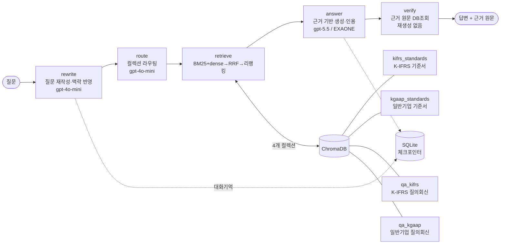

# 📘 회계기준 Manager

한국회계기준원(KASB)의 **K-IFRS 기준서 · 일반기업회계기준 · 질의회신**을 근거로 회계 질문에 답하는 RAG 어시스턴트입니다. 일반적인 챗봇과 달리 **답변과 함께 그 근거가 된 기준서 원문을 그대로 보여주고**, 근거로 뒷받침되지 않는 질문에는 답을 지어내지 않고 "근거를 찾지 못했습니다"라고 물러섭니다. 회계 실무처럼 **출처 확인이 곧 신뢰인 도메인**에서, "그럴듯한 답"보다 "검증 가능한 답"을 우선하도록 설계했습니다.

## ▶︎ 지금 바로 사용해보기

[](https://huggingface.co/spaces/sonsdf/accounting-standards-assistant)

**🤗 Live Demo → https://huggingface.co/spaces/sonsdf/accounting-standards-assistant**

앱 사이드바에 본인 **OpenAI API 키**를 입력하면 바로 질문할 수 있습니다 (키는 세션 메모리에만 저장되고 파일·로그에 남지 않습니다).

> ⏳ **처음 접속하거나 첫 질문을 던질 때는 1~2분 정도 걸릴 수 있습니다.** 무료 호스팅(Hugging Face Spaces)이라 앱이 한동안 쉬면 절전 상태로 들어가 다시 깨어나는 시간이 필요하고, 첫 질문 순간에 임베딩·리랭커 모델(BGE-M3 · bge-reranker-v2-m3, 합계 약 2.5GB)과 벡터DB(약 250MB)를 처음 한 번 내려받기 때문입니다. **두 번째 질문부터는 캐시되어 빠르게 응답**합니다. 로컬 실행 시에는 이 다운로드가 없어 훨씬 빠릅니다.


---

## 1. 해결하는 문제

회계 기준은 K-IFRS와 일반기업회계기준 두 체계로 나뉘고, 같은 주제라도 서로 다른 기준서 문단에서 다룹니다. 실무자는 "이 거래를 어느 기준의 어느 문단으로 처리하나"를 찾는 데 시간을 씁니다. 일반 LLM에 물으면 문단 번호를 그럴듯하게 지어내거나(환각) 두 체계를 뒤섞기 쉽습니다.

이 프로젝트는 KASB 코퍼스를 검색해 **실제 기준서 문단·질의회신을 근거로 답하고, 그 원문을 함께 제시**합니다. 답변은 생성하되 **근거는 DB 원문 그대로** 보여주어, 사용자가 답을 곧바로 검증할 수 있게 하는 것이 핵심입니다.

---

## 2. 주요 특징

- **3층 신뢰 UI** — ① 답변(인용 배지 포함) ② 근거 원문 카드(클릭 시 해당 근거로 이동) ③ 해설. 답변보다 **근거를 먼저** 렌더해 대기 체감을 줄이고 검증을 유도합니다.
- **하이브리드 검색** — BM25(어휘) + dense(의미) 병합 후 리랭커로 재정렬.
- **멀티 LLM** — GPT 기본 / 로컬 EXAONE 옵션(폐쇄망·오프라인용).
- **환각 방지** — 검색 근거로만 답하고, 근거가 없으면 refusal. 근거 원문은 LLM이 다시 쓰지 않고 DB 원문을 그대로 표시.
- **RAGAS 평가** — 검색(Recall/Precision)은 골든셋으로 기계 채점, 생성(Faithfulness/Relevancy)은 LLM 판사로 평가.

---

## 3. 시스템 아키텍처

LangGraph로 5개 노드를 파이프라인으로 연결하고, SQLite 체크포인터로 대화 맥락을 이어갑니다. 검색은 **4개 컬렉션**(기준서 2 + 질의회신 2)으로 분리해, 라우터가 질문 성격에 맞는 컬렉션만 고르게 했습니다.



- **rewrite**: 이전 대화를 반영해 질문을 검색에 유리하게 다시 씁니다.
- **route**: K-IFRS/일반기업 신호를 보고 검색할 컬렉션을 고릅니다. 신호가 모호하면 한쪽으로 좁히지 않고 양쪽 기준서·질의회신을 모두 검색해, 정답 컬렉션을 통째로 놓치는 일을 막습니다.
- **retrieve**: 하이브리드 검색 + 리랭킹. 라우팅된 각 기준서 컬렉션에서 최소 1건씩 보장합니다.
- **answer**: 검색 근거만 사용해 답하고, 인용은 `[제1116호 문단 7]`처럼 근거 식별자를 문장에 넣습니다.
- **verify**: 답변이 인용한 근거를 DB에서 **원문 그대로** 조회해 반환합니다(LLM 재생성 금지 → 원문 왜곡 방지).

### 실제 동작

아래는 *"회사가 상표권 출원·등록 관련 법률수수료를 지출한 경우 무형자산으로 인식할 수 있는가?"* 질문의 실제 결과입니다.

**① 근거 원문 카드** — 검색된 기준서·질의회신을 **원문 그대로**(LLM 재생성 없음) 보여주고, ★는 답변이 실제 인용한 근거입니다.


**② 답변 + 인용 + 품질 평가** — 문장마다 근거 식별자를 인용하고, 옵션을 켜면 LLM 판사가 근거 충실도·질문 관련성을 채점합니다(판사와 답변이 같은 벤더면 자기편향 경고).


---

## 4. 기술 스택과 선택 이유

### 데이터 수집·파싱
기준서와 질의회신은 KASB 게시판에서 HWP·PDF로 제공됩니다. HWP는 표 안에 핵심 내용이 들어가는 경우가 많은데, `hwp5txt`로 텍스트만 뽑으면 **표 구조가 통째로 유실**됐습니다. 그래서 `hwp5html`로 변환해 HTML 표를 파싱하는 방식을 택했습니다. 구형 문서는 스캔 PDF가 섞여 있어 `pdfplumber`를 썼는데, 2단 레이아웃에서 텍스트 순서가 뒤엉키는 문제를 좌표 기반으로 정렬해 **읽기 순서를 보존**했습니다.

### 청킹
레코드 1개를 청크 1개로 두고 **추가 분할을 하지 않았습니다.** 코퍼스가 이미 문단·용어정의·질의회신 Q&A 단위로 정제돼 있어서, 여기에 고정 크기 분할을 덧대면 짧은 조각이 양산됩니다. 짧은 조각은 임베딩이 밋밋해져 검색에서 오히려 불리하고, 문단 경계를 잘라 근거 인용의 단위(문단 번호)와도 어긋납니다. "이미 의미 단위로 나뉜 데이터는 그 단위를 존중한다"는 판단입니다.

### 임베딩
`BAAI/bge-m3`를 골랐습니다. 한국어를 포함한 다국어에 강하고, 로컬에서 구동할 수 있어(폐쇄망 지원 목표) API 의존 없이 dense 검색을 돌릴 수 있기 때문입니다. 긴 문단을 위해 fp16으로 올려 메모리·속도를 확보했습니다.

### 검색
BM25와 dense를 각각 돌린 뒤 **RRF(Reciprocal Rank Fusion, k=60)**로 병합하고, `BAAI/bge-reranker-v2-m3`로 재정렬합니다. RRF만 쓰면 상위 후보들의 점수가 0.03 언저리로 평탄하게 뭉쳐 순서를 가리기 어려웠는데, 크로스 인코더 리랭커가 (질문, 문단) 쌍을 직접 채점해 **점수를 벌려 정답을 상단으로 끌어올립니다.** 리랭커는 fp16 + max_length 512로 로드해, 대부분 짧은 문단에서 속도 손해 없이 처리합니다.

### 벡터DB
`ChromaDB`를 쓰고 **4개 컬렉션으로 분리**했습니다. 이 분리는 곧 라우팅 단위입니다. 초기에 한 컬렉션에 다 넣었더니 질의회신이 상위 결과를 독식해(질문과 문체가 비슷해 유사도가 높음) 정작 정답인 기준서 문단을 밀어냈습니다. 컬렉션을 나누고 라우터가 대상을 고르게 하니 이 편향이 크게 줄었습니다.

### LLM
기본은 GPT, 옵션으로 로컬 EXAONE입니다. 노드마다 필요한 능력이 달라 모델을 분담했습니다 — 가볍고 정형적인 `rewrite`·`route`는 `gpt-4o-mini`, 근거를 읽고 인용까지 지켜야 하는 `answer`는 `gpt-5.5`. GPT를 기본으로 둔 건 답변 품질과 **인용 형식 준수**가 안정적이기 때문입니다. EXAONE(`exaone3.5:7.8b`, Ollama) 옵션을 둔 건 한국어 회계 텍스트에 강하고 **로컬 구동으로 폐쇄망·오프라인을 지원**하기 위해서입니다. 다만 후술하듯 EXAONE는 근거 충실도에서 GPT에 못 미쳐 옵션으로 두었습니다.

### 신뢰 검증
가장 신경 쓴 부분입니다. **답변은 생성하되, 근거 원문은 LLM이 다시 쓰지 않고 DB 원문을 그대로** 화면에 싣습니다. 요약·재서술 과정에서 원문이 미묘하게 바뀌면 "근거"의 의미가 없어지기 때문입니다. 답변(생성) / 근거(원본 보존)를 분리해 **사용자가 답을 원문과 대조해 검증**할 수 있게 했습니다.

---

## 5. 성능 평가 (RAGAS)

### 검색 성능 (골든셋 1,192건, 기계 채점 · LLM 비용 0)

질의회신이 인용한 기준서 문단을 정답으로 삼아, 검색이 그 근거를 회수하는지 측정했습니다. recall을 **여러 관점으로 병기**해 정직하게 보여줍니다(엄격한 문단 exact부터, 질의 단위 성공률인 hit rate, 실질 성능에 가까운 호 recall까지).

| 지표 | top-5 | top-10 | 무엇을 재나 |
|---|---|---|---|
| **호 recall** | 0.734 | **0.808** | 올바른 기준서(제NNNN호/제N장)를 찾았는가 — **실질 성능에 가까움** |
| **문단 hit rate** | 0.289 | **0.373** | 정답 문단을 **1개라도** 회수한 질의 비율(Hit@k) — "최소 1건 근거 확보" 성공률 |
| 문단 recall (exact) | 0.203 | 0.267 | 인용된 정확한 문단까지 회수 — **가장 엄격** |
| 문단 recall (인접완화) | 0.228 | 0.302 | 정답 문단 1.0 + 바로 옆(±1) 문단 0.5점 |
| 문단 precision (exact) | 0.062 | 0.042 | 상위 k 중 정확 문단 비율 |

### 문단 exact 27%에 대한 정직한 해석

문단 exact가 27%로 낮게 보이지만, 이 숫자를 부풀리지 않고 그대로 둔 데는 이유가 있습니다.

- **채점 아티팩트가 아니라 실제 검색 성능입니다.** 실패 1,956건을 자동 분류하니 **진짜 검색 실패 96.4% / 표기 차이 3.6%**였습니다. 표기 차이(원문자·괄호 등)는 정규화로 채점에 이미 반영했고, 그 효과는 +0.0%p였습니다(골든셋에 실제 표기 불일치가 거의 없음). 즉 낮은 수치는 측정 문제가 아닙니다.
- **실패의 59%는 "호는 맞고 문단만 놓친 것"입니다.** 검색이 올바른 기준서(호 recall 81%)는 잘 찾지만, 질의회신이 인용한 정확한 문단 번호까지 top-k에 넣는 건 어렵습니다(1건당 평균 2.1·최대 14개 문단 인용). 이 경우에도 사용자는 정답 문단 부근의 같은 기준서 원문을 받으므로 **답변 품질에 미치는 영향은 제한적**입니다.
- 문단 exact는 정답 바로 옆 문단조차 오답으로 처리하는 매우 엄격한 지표라, **호 recall(0.808)이 실질 유용성에 더 가깝습니다.** 여러 지표를 모두 공개하는 이유입니다.
- **문단 hit rate(0.373)는 exact와 호 사이의 "질의 성공률" 관점입니다.** exact가 인용 문단을 *모두* 맞춰야 만점인 반면, hit rate는 한 질의에서 정답 문단을 **하나라도** top-k에 회수하면 성공(1.0)으로 봅니다. 즉 "이 질의에 최소 한 건의 정답 근거라도 상단에 띄웠는가"를 재는 지표로, 다문단 인용 질의(평균 2.1·최대 14문단)를 문단 수로 나눠 불리하게 잡던 exact를 보완합니다. 정의상 항상 **exact ≤ hit rate**이며, 관대한 지표이므로 exact를 대체하지 않고 함께 병기합니다.

또한 질의회신은 그 자신도 코퍼스에 임베딩돼 있어 자기 자신을 검색해버리는 **self-leakage**가 생길 수 있습니다. 배치 평가에서는 검색 대상을 기준서 컬렉션으로 한정해 질의회신 자기 자신을 원천 제외하고, "정답 기준서 근거를 회수하는가"만 측정했습니다.

### 왜 질의회신을 함께 임베딩했는가

문단 recall이 낮은 이유가, 곧 이 시스템이 질의회신을 코퍼스에 포함한 이유이기도 합니다.

위 recall은 질의회신의 **질문(question)**으로 검색해 그 질의회신이 인용한 **기준서 문단(standard_refs)**을 찾아오는지로 측정했습니다. 그런데 질의회신 질문은 "복잡한 실무 상황 서술"이고 정답인 기준서 문단은 "추상적 규정"이라, 둘 사이의 표면적 표현 차이가 큽니다. 임베딩 검색은 의미가 가까운 것을 찾으므로, 개념어가 뚜렷한 기준서(호) 단위는 잘 찾지만(호 recall 81%), 실무 질문과 추상 규정 사이의 표면 격차 때문에 정확한 문단까지 직접 매칭하기는 어렵습니다(문단 recall 27%).

바로 이 격차를 메우려고 질의회신을 코퍼스에 함께 넣었습니다. 질의회신은 "실무 질문 + 답변 + 근거 문단"이 한 세트라, 사용자의 실무 질문과 표면이 유사합니다. 사용자가 복잡한 상황을 물으면 표현이 닮은 질의회신이 먼저 매칭되고, 그 질의회신이 이미 정답 기준서 문단을 인용하고 있어 기준서 근거까지 자연스럽게 연결됩니다. 질의회신이 **실무 질문과 기준서 사이의 다리** 역할을 하는 셈입니다.

그리고 앞서 밝혔듯 배치 평가는 self-leakage를 막으려 이 질의회신 경로를 제외하고 측정했습니다. 즉 다리를 걷어낸 **가장 불리한 조건**에서 나온 값이므로, 질의회신이 함께 작동하는 실제 사용에서의 체감 성능은 위 수치보다 높습니다.

### 생성 성능 (LLM 판사, GPT vs EXAONE)

같은 질문을 답변 모델만 바꿔 생성하고 동일 판사(OpenAI)로 채점했습니다. **F=Faithfulness(근거 충실도), R=Answer Relevancy(질문 관련성).**

| 케이스 | GPT-5.5 *(판사와 동일 벤더 → 자기편향 참고)* | EXAONE *(독립 평가)* |
|---|---|---|
| 단기리스 | F 1.0 / R 1.0 | F 1.0 / R 1.0 |
| 파생상품 | F 1.0 / R 0.8 | **F 0.75** / R 1.0 |
| 틀린 전제 | F 1.0 / R 1.0 | **F 0.5** / R 0.9 |
| 근거 없음(미국세법) | refusal | refusal |

> **자기편향 주의:** GPT 답변을 OpenAI 판사가 채점하면 점수가 관대해질 수 있어 **GPT 점수는 참고용**입니다. 반면 EXAONE는 판사와 다른 벤더라 **독립 평가로 신뢰**할 수 있습니다. EXAONE의 낮은 Faithfulness(0.5~0.75)는 근거에 없는 내용을 덧붙이는 경향을 보여줍니다 — 실제로 검색 근거의 식별자 대신 자체 지식의 문단 번호를 인용하거나, 틀린 전제를 명확히 교정하지 못하는 사례가 관찰됐습니다. 근거가 없는 질문은 두 모델 모두 refusal해 환각 방지는 정상 작동합니다.

---

## 6. 설치 및 로컬 실행

**요구사항**: Python 3.9+, (로컬 EXAONE 사용 시) [Ollama](https://ollama.com)

```bash
# 1) 의존성 설치
python3 -m pip install -r requirements.txt

# 2) (선택) 로컬 EXAONE 사용 시
ollama pull exaone3.5:7.8b

# 3) 실행
python3 -m streamlit run rag/app.py
```

**API 키**는 `.env` 파일 또는 사이드바 입력창으로 넣습니다(입력값은 세션 메모리에만 저장).

```dotenv
# .env  (예시 — 실제 키는 커밋하지 마세요, .gitignore로 제외됨)
OPENAI_API_KEY=sk-...
# 선택: LangSmith 트레이싱
LANGCHAIN_API_KEY=lsv2_...
LANGCHAIN_PROJECT=kasb-rag
```

로컬 환경에서는 **GPT와 EXAONE를 모두** 쓸 수 있습니다. 사이드바 "모델 선택"에서 전환합니다.

---

## 7. 배포


**허깅페이스 Spaces**로 호스팅합니다. 무료 티어가 16GB RAM을 제공해 BGE-M3 임베더와 리랭커를 동시에 올릴 수 있기 때문입니다(Streamlit Community Cloud의 1GB로는 두 모델 동시 로드가 불가능했습니다). 벡터DB는 용량과 저작권 문제로 깃허브에 두지 않고, **허깅페이스 private 데이터셋**에 올려 앱 시작 시 토큰으로 내려받는 구조입니다. Spaces는 관리형이라 Streamlit SDK로 직접 생성되지 않아 **Docker SDK**로 배포했습니다(`Dockerfile`에서 Streamlit을 7860 포트로 구동).

**로컬 vs 배포 차이:**

| 환경 | 사용 가능 모델 |
|---|---|
| 로컬 | GPT + EXAONE(로컬) |
| 배포(Spaces) | GPT만 |

EXAONE가 배포판에서 빠지는 이유는 구동 방식 때문입니다. EXAONE는 **Ollama로 돌리는 로컬 모델**인데, Ollama는 사용자 머신이나 서버에 직접 설치해 실행하는 방식이라 허깅페이스 Spaces 같은 관리형 호스팅 환경에서는 띄울 수 없습니다. 그래서 배포판은 API 기반 GPT 경로만 제공하고, **EXAONE(로컬 폐쇄망용)는 저장소를 클론해 로컬에서 실행할 때** 사용하는 것으로 역할을 나눴습니다.

---

## 8. 데이터 출처

모든 원문 데이터는 **한국회계기준원(KASB)** 공개 게시판에서 수집했습니다 — [www.kasb.or.kr](https://www.kasb.or.kr)

- **K-IFRS 기준서** (기준서 문단·용어정의)
- **일반기업회계기준** (장·문단)
- **질의회신** (K-IFRS / 일반기업 각 게시판)

> **저작권 안내:** 기준서·질의회신 **원문의 저작권은 한국회계기준원(KASB)에 있습니다.** 이 저장소에는 코드와 **데이터 구조를 보여주는 소량 샘플**(`data/sample/`, 게시판·기준서별 2~3건)만 포함합니다. 전체 데이터는 저장소에 담지 않으며, 크롤러(`crawler.py`, `standards_crawler.py`)로 공식 출처에서 직접 수집해 재현할 수 있습니다. 상세 재현 절차는 `data/sample/`의 구조와 크롤러 스크립트를 참고하세요.

---

## 프로젝트 구조

```
rag/            # RAG 파이프라인 (LangGraph)
  ├─ app.py        # Streamlit UI (3층 신뢰 구조)
  ├─ graph.py      # 5노드 파이프라인 (rewrite→route→retrieve→answer→verify)
  ├─ search.py     # 하이브리드 검색 (BM25+dense→RRF→리랭킹)
  ├─ llm.py        # 모델 추상화 (GPT / EXAONE)
  ├─ common.py     # 임베더·리랭커·컬렉션 정의
  └─ eval/         # RAGAS 평가 (배치 + 실시간 판사)
crawler.py            # 질의회신 크롤러
standards_crawler.py  # 기준서 크롤러
parsers/              # HWP/PDF 파서
data/sample/          # 공개용 소량 샘플 (구조 예시)
eval/results/summary.md   # 검색 성능표
```

---

*made by gyuyeong*
